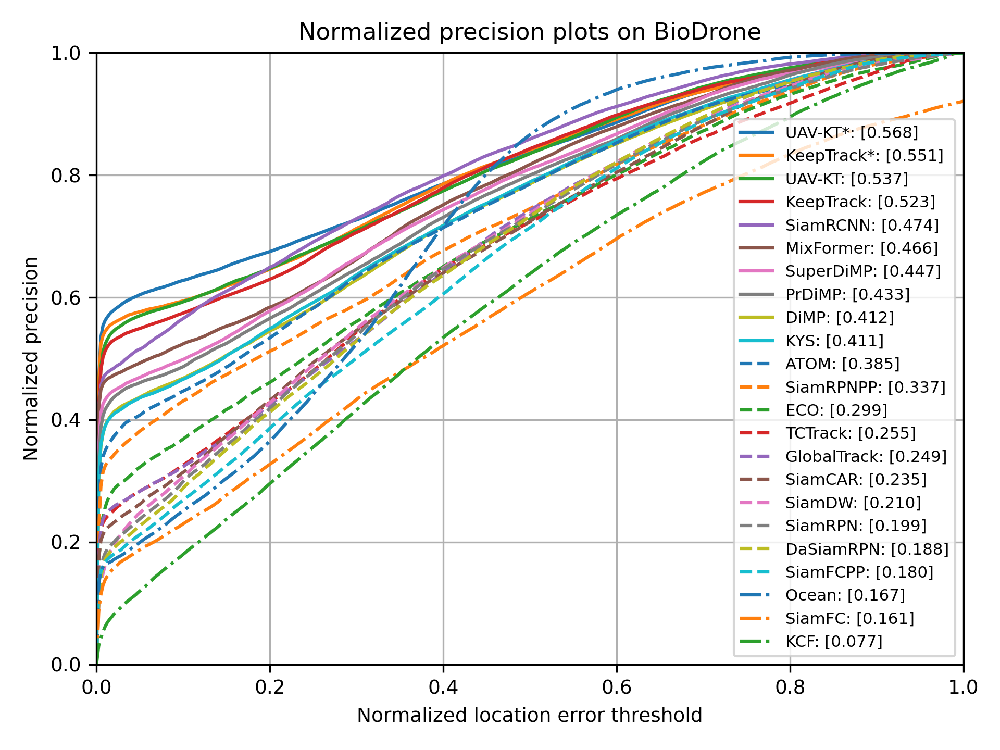

# BioDrone Python Toolkit

> UPDATE:<br>
> [2023.02.15] Update the toolkit installation, dataset download instructions and a concise example. Now the basic function of this toolkit has been finished. <br>

This repository contains the official python toolkit for running experiments and evaluate performance on [BioDrone](http://biodrone.aitestunion.com/). The code is written in pure python and is compile-free.


## Table of Contents

- [Python Toolkit](#python-toolkit)
  - [Table of Contents](#table-of-contents)
    - [Toolkit Installation](#toolkit-installation)
    - [Dataset Download](#dataset-download)
    - [A Concise Example](#a-concise-example)
      - [How to Define a Tracker?](#how-to-define-a-tracker)
      - [How to Run Experiments?](#how-to-run-experiments)
      - [How to Evaluate Performance?](#how-to-evaluate-performance)
    - [Results of SOTA Trackers](#results-of-sota-trackers)
    - [Issues](#issues)


### Toolkit Installation

Clone the repository and install dependencies:

```
git clone https://github.com/huuuuusy/biodrone-toolkit-official.git
pip install -r requirements.txt
```

Then directly copy the `biodrone` folder to your workspace to use it.

### Dataset Download

The dataset for the 3rd HISLOPVISION challenge includes 300 sequences, divided into three subsets (*train*/*val*/*test*). 

The dataset download and file organization process is as follows：

- Download three subsets via [download](http://biodrone.aitestunion.com/downloads) page in the project website (total: 142G).

- Check the number of files in each subset and run the unzipping script. Before unzipping:

  - the *train* subset should includ 300 files

  - the *val* subset should includ 100 files

  - the *test* subset should includ 200 files

- Run the unzipping script, and delete the script after decompression.

- Taking *train* subset as an example, the folder structure should follow:

```
|-- train/
|  |-- frame_002/
|  |  |-- 00000001.jpg/
|  |      ......
|  |  |-- 00000706.jpg/
|  |-- frame_004/
|  |   ......
|  |-- frame_597/
|  |-- frame_599/
```

- Unzip *attribute.zip*:

```
unzip attribute.zip -d attribute
```

- Attention that we only provide properties files for *train* and *val* subsets. For ground-truth files, we only offer the annotation of the first frame to initialize the model. You should upload final results for evaluation.

- Rename and organize folders as follows：

```
|-- BioDrone/
|  |-- data/
|  |  |-- train/
|  |  |  |-- frame_002/
|  |  |  |   ......
|  |  |  |-- frame_599/
|  |  |-- val/
|  |  |  |-- frame_005/
|  |  |  |   ......
|  |  |  |-- frame_594/
|  |  |-- test/
|  |  |  |-- frame_001/
|  |  |  |   ......
|  |  |  |-- frame_600/
|  |-- attribute/
|  |  |-- absent/
|  |  |-- color_constancy_tran/
|  |  |   ......
|  |  |-- shotcut/
```

### A Concise Example

[test.py](./test.py) is a simple example on how to use the toolkit to define a tracker, run experiments on dataset and evaluate performance.

#### How to Define a Tracker?

To define a tracker using the toolkit, simply inherit and override `init` and `update` methods from the [`Tracker`](./biodrone/trackers/__init__.py) class. You can find an example in this [page](./tracker/siamfc.py). Here is a simple example:

```Python
from biodrone.trackers import Tracker

class IdentityTracker(Tracker):
    def __init__(self):
        super(IdentityTracker, self).__init__(
            name='IdentityTracker',  # tracker name
        )
    
    def init(self, image, box):
        self.box = box

    def update(self, image):
        return self.box
```

#### How to Run Experiments?

Instantiate an [`ExperimentBioDrone`](./biodrone/experiments/biodrone.py) object, and leave all experiment pipelines to its `run` method:

```Python
from biodrone.experiments import ExperimentBioDrone

# ... tracker definition ...

# instantiate a tracker
tracker = IdentityTracker()

# setup experiment (validation subset)
experiment = ExperimentBioDrone(
  root_dir='SOT/BioDrone', # dataset's root directory
  save_dir= os.path.join(root_dir,'result'), # the path to save the experiment result
  subset='val', # 'train' | 'val' | 'test'
  repetition=1 
)
experiment.run(
  tracker, 
  visualize=False,
  save_img=False
  )
```

#### How to Evaluate Performance?

For evaluation in OPE mechanism, please use the `report` method of [`ExperimentBioDrone`](./biodrone/experiments/biodrone.py) for this purpose:

```Python
# ... run experiments on dataset ...

# report tracking performance
experiment.report([tracker.name])
```

### Results of SOTA Trackers on Testset

|Metrics|OPE Mechanism|R-OPE Mechanism|
|----|----|----|
|precision plot|||
|normalized precision plot|||
|success plot|||

### Issues

Please report any problems or suggessions in the [Issues](https://github.com/huuuuusy/biodrone-toolkit-official/issues) page.
